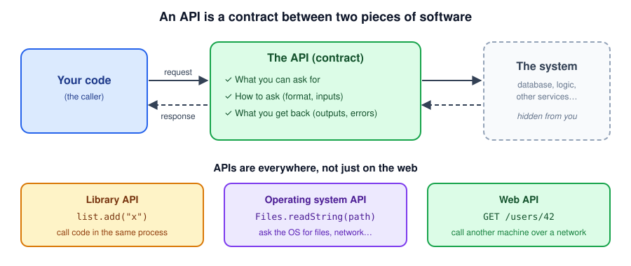
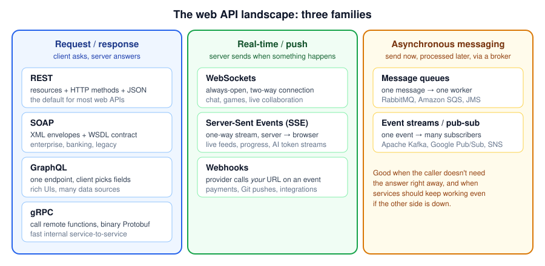
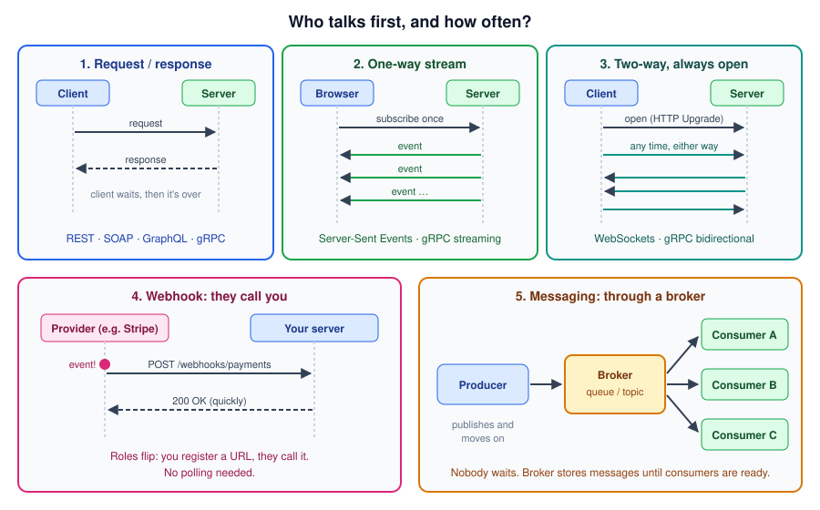
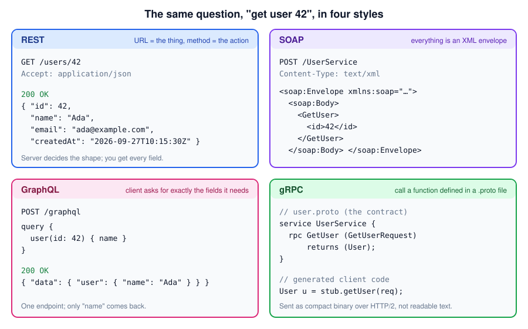

# APIs — What They Are and Which Style to Use

A simple guide to what an API is, the main styles of web API (REST, SOAP, GraphQL, gRPC, WebSockets, SSE, webhooks, messaging), and how to pick the right one.

> **See also:** [intro_web.md](intro_web.md) (how HTTP and the web work) · [rest_api.md](rest_api.md) (deep dive on designing REST APIs)

---

## Table of Contents

- [What Is an API?](#what-is-an-api)
- [Why APIs Matter](#why-apis-matter)
- [The Web API Landscape](#the-web-api-landscape)
- [Who Talks First? Communication Patterns](#who-talks-first-communication-patterns)
- [The Same Request in Four Styles](#the-same-request-in-four-styles)
- [Request / Response Styles](#request--response-styles)
  - [REST](#rest)
  - [SOAP](#soap)
  - [GraphQL](#graphql)
  - [gRPC](#grpc)
- [Real-Time and Push Styles](#real-time-and-push-styles)
  - [WebSockets](#websockets)
  - [Server-Sent Events (SSE)](#server-sent-events-sse)
  - [Webhooks](#webhooks)
- [Asynchronous Messaging](#asynchronous-messaging)
- [Side-by-Side Comparison](#side-by-side-comparison)
- [How to Choose](#how-to-choose)
- [Mixing Styles Is Normal](#mixing-styles-is-normal)
- [API Contracts and Spec Formats](#api-contracts-and-spec-formats)
- [Other Names You Might Hear](#other-names-you-might-hear)
- [Further Reading](#further-reading)

---

## What Is an API?

An **API** (Application Programming Interface) is a **contract** that says how one piece of software can use another: what you can ask for, how to ask, and what you get back. You don't need to know how the other side works inside.

Think of a restaurant menu. You don't go into the kitchen. You pick from the menu (the API), place an order in the expected way (the request), and get a dish back (the response). The kitchen can change its staff, ovens or suppliers, and as long as the menu stays the same, you never notice.



| Kind of API | What it looks like | Example |
|---|---|---|
| **Library API** | Methods and classes you call in the same program | `list.add("x")`, `LocalDate.now()` |
| **Operating system API** | Calls into the OS for files, network, processes | `Files.readString(path)`, POSIX `open()` |
| **Web API** | Messages sent to another machine over a network | `GET https://api.example.com/users/42` |

When developers say "API" today they usually mean a **web API**, and that's the focus of the rest of this guide.

---

## Why APIs Matter

- **Decoupling:** teams and systems can change their internals without breaking each other, as long as the contract holds.
- **Reuse:** one backend serves web, mobile, partners and other services.
- **Integration:** you can plug in payments, maps, email or AI without building them yourself.
- **Security boundary:** the API decides exactly what outsiders can see and do. Nobody touches your database directly.

> Once someone depends on your API, **changing the contract is expensive**. Choosing the right style and designing it carefully up front saves a lot of pain later.

---

## The Web API Landscape

Most web API styles fall into three families, depending on **who starts the conversation** and **whether anyone waits for the answer**.



| Family | In one sentence | Styles |
|---|---|---|
| **Request / response** | The client asks and waits; the server answers. | REST, SOAP, GraphQL, gRPC |
| **Real-time / push** | The server sends data when something happens, without being asked each time. | WebSockets, SSE, webhooks |
| **Asynchronous messaging** | A sender drops a message into a broker and moves on; receivers process it when they're ready. | Message queues, event streams |

---

## Who Talks First? Communication Patterns

The biggest difference between styles is the *shape* of the conversation:



1. **Request / response:** one question, one answer, done.
2. **One-way stream:** the client subscribes once, and the server keeps sending events.
3. **Two-way, always open:** either side can send a message at any time over one connection.
4. **Webhook:** the roles flip. You give a provider a URL, and *they* send a request to it when an event happens.
5. **Messaging:** producers and consumers never talk directly. A broker sits in between and stores messages.

---

## The Same Request in Four Styles

Here is "get user 42" in each request/response style. The goal is the same, but the look and feel is very different:



---

## Request / Response Styles

### REST

**What it is:** an architectural style built on plain HTTP. Every "thing" is a **resource** with a URL, and you act on it with HTTP methods (`GET`, `POST`, `PUT`, `PATCH`, `DELETE`). Data is usually JSON.

```http
GET /api/v1/orders/7 HTTP/1.1
Accept: application/json
```

| Strengths | Weaknesses |
|---|---|
| Simple, universal, every language and tool supports it | Can **over-fetch** (too many fields) or **under-fetch** (need several calls) |
| Works with HTTP caching, CDNs, proxies out of the box | No single enforced contract; relies on discipline + OpenAPI |
| Human-readable, easy to debug with `curl` and a browser | Many round trips for deeply nested data |

**Use it when:** building public APIs, CRUD-style services, most web and mobile backends. **This is the default choice.**
**Avoid it when:** you need real-time push, or chatty high-performance internal calls.

> Full design guide: [rest_api.md](rest_api.md)

---

### SOAP

**What it is:** a formal **protocol** (not just a style) where every message is an **XML envelope**. The contract is a machine-readable **WSDL** file that describes every operation and data type. It usually runs over HTTP `POST`, but it can also run over other transports such as JMS.

```xml
<soap:Envelope xmlns:soap="http://www.w3.org/2003/05/soap-envelope">
  <soap:Header><!-- security, transactions, routing --></soap:Header>
  <soap:Body>
    <GetUser><id>42</id></GetUser>
  </soap:Body>
</soap:Envelope>
```

| Strengths | Weaknesses |
|---|---|
| Strict, formal contract (WSDL); clients can be generated | Verbose XML, slower to parse, larger payloads |
| Built-in standards: **WS-Security** (message-level signing/encryption), reliable messaging, transactions | Heavy tooling; harder to use from browsers and modern stacks |
| Errors are standardized (`<soap:Fault>`) | No HTTP caching (everything is a `POST`) |

**Use it when:** integrating with **existing** enterprise, banking, insurance, telecom or government systems that expose SOAP, or when a partner contract **requires** WS-Security or formal WSDL.
**Avoid it when:** starting a new API with no such constraint. Choose REST or gRPC instead.

> **Java tooling:** Jakarta XML Web Services (JAX-WS), Apache CXF, Spring Web Services. Generate client classes from the WSDL rather than writing XML by hand.

---

### GraphQL

**What it is:** a **query language** for APIs. The server publishes a typed **schema**, and the client sends a query to a **single endpoint** saying exactly which fields it wants, including related data, in one request.

```graphql
# Schema (server)                       # Query (client)
type User {                             query {
  id: ID!                                 user(id: 42) {
  name: String!                             name
  orders: [Order!]!                         orders { id total }
}                                         }
                                        }
```

It has three operation types: **query** (read), **mutation** (write) and **subscription** (real-time updates, usually over WebSockets).

| Strengths | Weaknesses |
|---|---|
| No over/under-fetching; one round trip for nested data | HTTP caching doesn't work out of the box (mostly `POST` to one URL) |
| Strongly typed schema; great tooling and autocomplete | Easy to create **N+1 database queries**; needs batching (e.g. DataLoader) |
| Frontend can evolve without new backend endpoints | Clients can send very expensive queries; needs depth/complexity limits |
| | Errors often come back as `200 OK` with an `errors` array, so monitoring is less obvious |

**Use it when:** many different clients (web, mobile, partners) need different slices of data, or a UI pulls together data from many backend services.
**Avoid it when:** you have a simple CRUD API, file uploads/downloads, or service-to-service calls. REST or gRPC is simpler there.

> **Java tooling:** Spring for GraphQL, Netflix DGS.

---

### gRPC

**What it is:** a high-performance **RPC** (Remote Procedure Call) framework from Google. You define services and messages in a **`.proto`** file, generate client and server code for any language, and call remote methods as if they were local. Messages are compact binary **Protocol Buffers** sent over **HTTP/2**.

```protobuf
syntax = "proto3";

service UserService {
  rpc GetUser (GetUserRequest) returns (User);
  rpc WatchUsers (WatchRequest) returns (stream User);   // server streaming
}

message GetUserRequest { int64 id = 1; }
message User { int64 id = 1; string name = 2; string email = 3; }
```

It supports four call types: **unary** (one request, one response), **server streaming**, **client streaming**, and **bidirectional streaming**.

| Strengths | Weaknesses |
|---|---|
| Fast: small binary payloads, HTTP/2 multiplexing | Browsers can't call it directly; needs **gRPC-Web** or a proxy/gateway |
| Strict contract; generated, type-safe clients in many languages | Binary payloads aren't human-readable; needs tools like `grpcurl` |
| Built-in streaming, deadlines/timeouts, cancellation | Long-lived HTTP/2 connections need L7 (request-aware) load balancing |
| Backward-compatible schema evolution with field numbers | Smaller ecosystem for public/partner APIs than REST |

**Use it when:** internal **microservice-to-microservice** calls, low-latency or high-throughput systems, polyglot teams that want one shared contract, or streaming between services.
**Avoid it when:** building a public API for third parties, or calling from browsers without a gateway.

> **Java tooling:** grpc-java, Spring gRPC.

---

## Real-Time and Push Styles

Request/response has one big limit: **the server can't speak until the client asks**. The naive fix is **polling** (asking "anything new?" every few seconds). It's simple, but it wastes requests and adds delay. The styles below solve that.

### WebSockets

**What it is:** a **persistent, two-way** connection between client and server. It starts as a normal HTTP request with an `Upgrade: websocket` header. The server replies `101 Switching Protocols`, and from then on either side can send messages at any time over `wss://`.

```javascript
const socket = new WebSocket("wss://chat.example.com/rooms/42");
socket.onmessage = (event) => console.log("received", event.data);
socket.send(JSON.stringify({ text: "hello" }));
```

| Strengths | Weaknesses |
|---|---|
| True two-way, low-latency communication | Stateful connections are harder to scale and load-balance |
| One connection instead of repeated requests | Needs reconnection, heartbeats, and backpressure handling |
| Supported by every modern browser | Some proxies and firewalls interfere; no built-in request/response semantics |

**Use it when:** chat, multiplayer games, collaborative editing, live trading dashboards, where **both sides** send frequently.
**Avoid it when:** only the server needs to push (use SSE), or updates are infrequent (use plain requests or webhooks).

> **Scaling tip:** with several server instances, a message for user A may arrive at an instance that doesn't hold A's connection. Use a shared pub/sub layer (e.g. Redis, a message broker) to broadcast between instances. Spring supports WebSockets and STOMP messaging on top of them.

---

### Server-Sent Events (SSE)

**What it is:** a **one-way** stream from server to client over a normal HTTP response with `Content-Type: text/event-stream`. The server keeps the response open and writes events as they happen. Browsers read it with the built-in `EventSource` API, which **reconnects automatically**.

```
HTTP/1.1 200 OK
Content-Type: text/event-stream

event: progress
data: {"percent": 40}

event: progress
data: {"percent": 80}
```

```javascript
const events = new EventSource("/api/jobs/7/events");
events.addEventListener("progress", (e) => console.log(JSON.parse(e.data)));
```

| Strengths | Weaknesses |
|---|---|
| Much simpler than WebSockets; plain HTTP works through proxies | One direction only (server → client) |
| Auto-reconnect and resume (`Last-Event-ID`) built in | Text only (send JSON or Base64 for anything else) |
| Easy to implement on any server | Over HTTP/1.1 browsers limit open connections per domain; use HTTP/2 |

**Use it when:** live notifications, news or sports feeds, progress bars for long jobs, log tailing, streaming AI responses token by token.
**Avoid it when:** the client also needs to send frequent messages (use WebSockets).

> **Java tooling:** Spring MVC `SseEmitter`, or return a `Flux<ServerSentEvent<T>>` in Spring WebFlux.

---

### Webhooks

**What it is:** a "reverse API". Instead of you asking a provider "did anything happen?", you **register a URL**, and the provider sends an HTTP `POST` to it when an event occurs (payment succeeded, code pushed, form submitted).

```http
POST /webhooks/payments HTTP/1.1
Host: your-app.example.com
Content-Type: application/json
X-Signature: t=1727431200,v1=5257a869e7ecebeda32affa62cdca3fa51cad7e77a0e56ff536d0ce8e108d8bd

{ "id": "evt_123", "type": "payment.succeeded", "data": { "orderId": 7, "amount": 1999 } }
```

| Strengths | Weaknesses |
|---|---|
| No polling; you hear about events almost immediately | You must expose a public HTTPS endpoint |
| Simple: it's just an HTTP request to your server | Hard to test locally (need a tunnel or the provider's CLI) |
| Standard way SaaS platforms notify you | Delivery can fail, repeat, or arrive out of order |

**Use it when:** integrating with third-party platforms (Stripe, GitHub, Slack, Twilio, Shopify), or offering event notifications to **your** customers' servers.
**Avoid it when:** the receiver is a browser or mobile app (they can't expose a URL), or you need guaranteed ordering (use messaging).

**Webhook receiver checklist:**
- **Verify the signature** (usually an HMAC of the body with a shared secret) before trusting the payload.
- **Respond `2xx` fast**, then process in the background. Providers time out and retry slow endpoints.
- **Be idempotent:** store the event `id` and ignore duplicates, because providers retry.
- Don't assume ordering. Re-fetch the latest state from the provider's API if order matters.

---

## Asynchronous Messaging

**What it is:** services communicate by sending **messages** to a **broker** instead of calling each other directly. The producer publishes and moves on, and consumers pick up messages when they're ready. If a consumer is down, messages wait in the broker.

There are two main models:

| Model | How it works | Example use | Tools |
|---|---|---|---|
| **Queue** (point-to-point) | Each message is processed by **one** worker; add workers to scale | Send emails, resize images, process orders | RabbitMQ, Amazon SQS, ActiveMQ / JMS |
| **Pub/sub / event stream** | Each event goes to **every** subscriber; streams can keep history for replay | `OrderPlaced` → billing, shipping, analytics all react | Apache Kafka, Google Pub/Sub, Amazon SNS, RabbitMQ exchanges |

```
OrderService  ──publish "OrderPlaced"──▶  [ orders topic ]  ──▶ BillingService
                                                            ──▶ ShippingService
                                                            ──▶ AnalyticsService
```

| Strengths | Weaknesses |
|---|---|
| **Loose coupling:** producer doesn't know who consumes | **Eventual consistency:** results aren't immediate |
| **Resilience:** survives consumer outages; absorbs traffic spikes | Harder to debug and trace across services |
| Easy to add new consumers without touching the producer | Most brokers deliver **at least once**, so consumers must handle duplicates |
| Natural fit for background work and event-driven design | Another piece of infrastructure to run and monitor |

**Use it when:** the caller doesn't need an immediate answer, work can happen in the background, several services must react to the same event, or you need to smooth out traffic spikes.
**Avoid it when:** the user is waiting on the result right now (e.g. "show me my balance"). Use a request/response API for that.

> **Must-haves:** idempotent consumers, a **dead-letter queue** for messages that keep failing, and a correlation id carried through every message so you can trace a flow. **Java tooling:** Spring for Apache Kafka, Spring AMQP (RabbitMQ), Jakarta Messaging (JMS).

---

## Side-by-Side Comparison

| | REST | SOAP | GraphQL | gRPC | WebSockets | SSE | Webhooks | Messaging |
|---|---|---|---|---|---|---|---|---|
| **Direction** | Client → server | Client → server | Client → server (+ subscriptions) | Both (streaming) | Both | Server → client | Provider → your server | Producer → broker → consumers |
| **Format** | JSON (usually) | XML | JSON | Protobuf (binary) | Any (text/binary) | Text | JSON (usually) | Any |
| **Transport** | HTTP | HTTP (mostly) | HTTP | HTTP/2 | WebSocket over TCP | HTTP | HTTP | Broker protocol (AMQP, Kafka…) |
| **Contract** | OpenAPI (optional) | WSDL (required) | Schema (required) | `.proto` (required) | None built in | None built in | Provider docs | AsyncAPI (optional) |
| **Browser-friendly** | ✅ | ⚠️ awkward | ✅ | ❌ (needs gRPC-Web) | ✅ | ✅ | n/a (server-to-server) | ❌ (backend only) |
| **HTTP caching** | ✅ | ❌ | ❌ mostly | ❌ | ❌ | ❌ | ❌ | n/a |
| **Performance** | Good | Heavier | Good | Excellent | Excellent | Good | Good | High throughput |
| **Learning curve** | Low | High | Medium | Medium | Medium | Low | Low | Medium–High |
| **Sweet spot** | Public & CRUD APIs | Enterprise/legacy integration | Flexible UIs over many sources | Internal microservices | Chat, games, collaboration | Live feeds, progress, AI streaming | Third-party event notifications | Background work, event-driven systems |

---

## How to Choose

Work down the list and stop at the first "yes":


**Quick rules of thumb:**
- **Not sure? Start with REST.** It's the easiest to build, consume, debug and hire for.
- **Public or partner API?** REST (with OpenAPI docs). Add webhooks for events.
- **Internal service-to-service, performance-sensitive?** gRPC.
- **Complex frontend pulling from many services?** GraphQL, often as a gateway in front of REST/gRPC services.
- **Browser needs live updates?** SSE if one-way, WebSockets if two-way.
- **Work can happen later, or many services must react?** Messaging.
- **A partner only speaks SOAP?** SOAP, generated from their WSDL. Don't fight it.

---

## Mixing Styles Is Normal

Real systems rarely use just one style. A typical e-commerce platform might use:

| Where | Style | Why |
|---|---|---|
| Mobile & web apps → backend | **REST** (or **GraphQL** gateway) | Simple, cacheable, works everywhere |
| Backend service → service | **gRPC** | Fast, typed internal calls |
| "Order placed" → billing, shipping, email | **Kafka / RabbitMQ** | Decoupled, resilient, async |
| Payment provider → backend | **Webhook** | Provider notifies you when payment clears |
| Order-tracking page | **SSE** | Server pushes status updates to the browser |
| Customer support chat | **WebSockets** | Two-way, real-time |
| Legacy insurance partner | **SOAP** | Their system requires it |

The skill is matching **each interaction** to the style that fits it, not picking one style for everything.

---

## API Contracts and Spec Formats

Whatever style you use, write the contract down in a machine-readable format. It becomes your documentation, lets you generate clients, and allows contract testing.

| Style | Contract format | Common tools |
|---|---|---|
| REST | **OpenAPI** (formerly Swagger) | springdoc-openapi, Swagger UI, OpenAPI Generator |
| SOAP | **WSDL** + XSD | wsimport, Apache CXF |
| GraphQL | **Schema** (SDL) | GraphiQL, Apollo, GraphQL Code Generator |
| gRPC | **`.proto`** files | `protoc`, Buf, `grpcurl` |
| Messaging / events | **AsyncAPI** | AsyncAPI Studio, AsyncAPI Generator |

---

## Other Names You Might Hear

| Name | What it is |
|---|---|
| **RPC** | "Remote Procedure Call": calling a function on another machine. gRPC, JSON-RPC and SOAP are all RPC-style. |
| **JSON-RPC** | A tiny RPC protocol: `{"method": "getUser", "params": [42], "id": 1}`. Used by blockchain nodes and the Language Server Protocol. |
| **XML-RPC** | The older, simpler predecessor of SOAP. |
| **OData** | A Microsoft-led standard that adds query conventions to REST (`$filter`, `$select`, `$expand`). Common in SAP and Microsoft ecosystems. |
| **tRPC** | End-to-end type-safe RPC for TypeScript apps where frontend and backend share types. |
| **Long polling** | The client makes a request and the server holds it open until there's news, then the client asks again. An older fallback for real-time. |
| **API gateway** | A front door (Kong, AWS API Gateway, Spring Cloud Gateway) that handles auth, rate limiting and routing for many APIs. |

---

## Further Reading

- [rest_api.md](rest_api.md): designing REST APIs in depth
- [intro_web.md](intro_web.md): how HTTP, DNS and TLS work underneath all of these
- [MDN — WebSockets API](https://developer.mozilla.org/en-US/docs/Web/API/WebSockets_API)
- [MDN — Using server-sent events](https://developer.mozilla.org/en-US/docs/Web/API/Server-sent_events/Using_server-sent_events)
- [GraphQL — Learn](https://graphql.org/learn/)
- [gRPC — Introduction](https://grpc.io/docs/what-is-grpc/introduction/)
- [W3C — SOAP 1.2 Primer](https://www.w3.org/TR/soap12-part0/)
- [AsyncAPI](https://www.asyncapi.com/) · [OpenAPI](https://www.openapis.org/)
