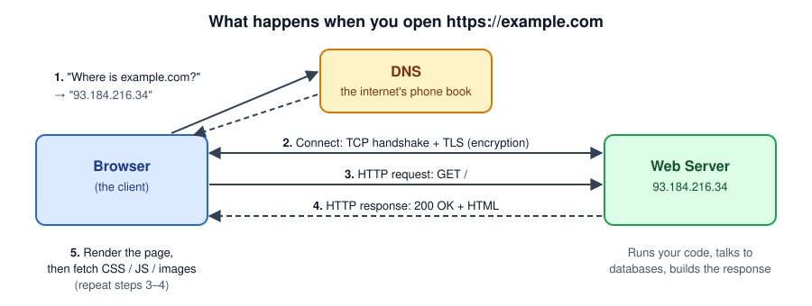
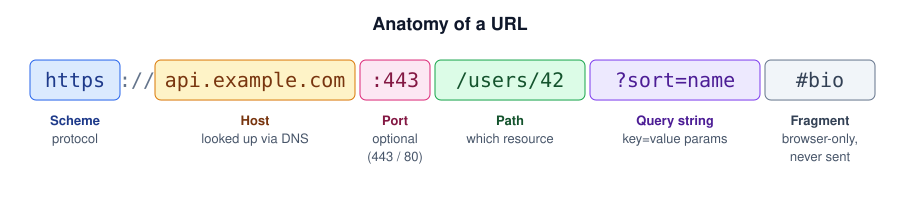
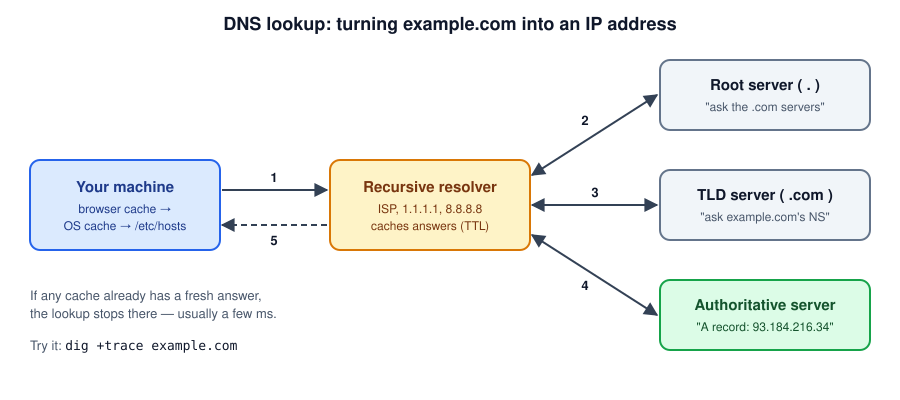
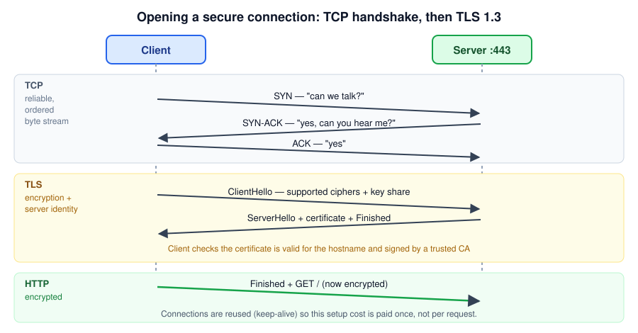
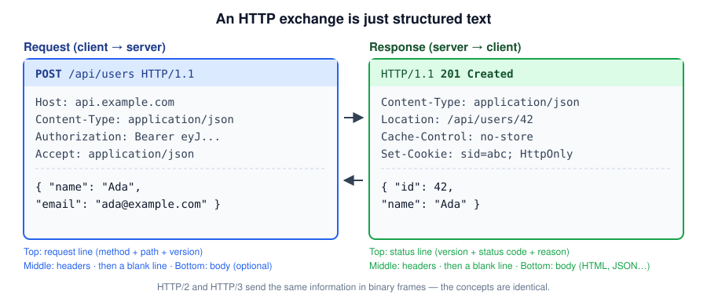
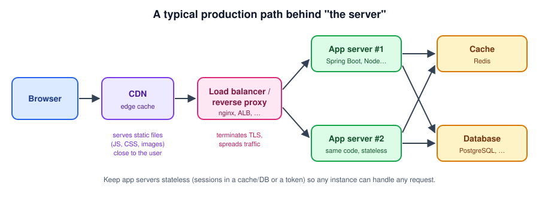
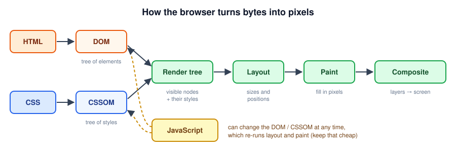

# How the Web Works — A Developer's Introduction

A simple, end-to-end walkthrough of what actually happens between typing a URL and seeing a page, with the parts that matter most when you build and debug web applications.

---

## Table of Contents

- [The One-Sentence Version](#the-one-sentence-version)
- [Key Vocabulary](#key-vocabulary)
- [The Big Picture](#the-big-picture)
- [Step 0 — The URL](#step-0--the-url)
- [Step 1 — DNS: Finding the Server](#step-1--dns-finding-the-server)
- [Step 2 — TCP + TLS: Opening a Secure Connection](#step-2--tcp--tls-opening-a-secure-connection)
- [Step 3 — HTTP: Asking and Answering](#step-3--http-asking-and-answering)
- [Step 4 — What Happens on the Server](#step-4--what-happens-on-the-server)
- [Step 5 — The Browser Renders the Page](#step-5--the-browser-renders-the-page)
- [The Layers, Side by Side](#the-layers-side-by-side)
- [Try It Yourself](#try-it-yourself)
- [Common Gotchas for Developers](#common-gotchas-for-developers)
- [Further Reading](#further-reading)

---

## The One-Sentence Version

The web is **clients** (usually browsers) sending **HTTP requests** to **servers** over the internet, and servers sending back **responses** (HTML, JSON, images, …).

Everything else — DNS, TCP, TLS, CDNs, load balancers — exists to make that request/response exchange findable, reliable, secure, and fast.

---

## Key Vocabulary

| Term | Plain-English meaning |
|---|---|
| **Client** | The program making the request — a browser, `curl`, a mobile app, or another backend service. |
| **Server** | A program listening on a network port, waiting for requests and sending responses. |
| **IP address** | The numeric address of a machine on the network, e.g. `93.184.216.34` (IPv4) or `2606:2800:220:1::` (IPv6). |
| **Port** | Which program on that machine to talk to. HTTP defaults to `80`, HTTPS to `443`. |
| **DNS** | The system that turns names (`example.com`) into IP addresses. |
| **TCP** | Gives you a reliable, ordered stream of bytes between two machines. |
| **TLS** | Encrypts that stream and proves the server is who it claims to be. It's the "S" in HTTPS. |
| **HTTP** | The language client and server speak: methods, paths, headers, status codes, bodies. |
| **URL** | The full address of a resource: where it is and how to get it. |

---

## The Big Picture



1. **DNS** — "Where is `example.com`?" → "`93.184.216.34`".
2. **Connect** — open a TCP connection and set up TLS encryption.
3. **Request** — send `GET /` over that connection.
4. **Response** — the server replies `200 OK` with HTML.
5. **Render** — the browser draws the page, discovers more files (CSS, JS, images), and repeats steps 3–4 for each one.

The rest of this guide zooms into each step.

---

## Step 0 — The URL



| Part | Example | Notes |
|---|---|---|
| Scheme | `https` | Protocol to use. `https` implies port 443 unless stated. |
| Host | `api.example.com` | Resolved to an IP via DNS. Also sent to the server in the `Host` header so one server can host many sites. |
| Port | `:443` | Usually omitted. You'll see it in dev: `http://localhost:8080`. |
| Path | `/users/42` | Which resource on the server. Your router/controller maps this to code. |
| Query | `?sort=name` | Key/value parameters. Must be URL-encoded (space → `%20`). |
| Fragment | `#bio` | **Never sent to the server.** Used by the browser (scrolling, client-side routing). |

> **Origin** = scheme + host + port. `https://example.com` and `https://api.example.com` are *different origins* — this matters for CORS and cookies.

---

## Step 1 — DNS: Finding the Server

Computers route by IP address, not by name. DNS is the distributed "phone book" that maps one to the other.



1. Your machine checks its caches (browser, OS, `/etc/hosts`). If found, done.
2. Otherwise it asks a **recursive resolver** (your ISP, `1.1.1.1`, `8.8.8.8`, or your company's DNS).
3. The resolver asks a **root server** → which points to the **`.com` TLD server** → which points to **example.com's authoritative server** → which returns the answer.
4. Every answer carries a **TTL** (time to live), so it gets cached along the way.

**Common record types:**

| Record | Maps | Example |
|---|---|---|
| `A` | name → IPv4 | `example.com → 93.184.216.34` |
| `AAAA` | name → IPv6 | `example.com → 2606:2800:220:1::` |
| `CNAME` | name → another name | `www.example.com → example.com` |
| `MX` | domain → mail server | `example.com → mail.example.com` |
| `TXT` | arbitrary text | domain verification, SPF |

> **Dev tip:** `/etc/hosts` (or `C:\Windows\System32\drivers\etc\hosts`) overrides DNS on your machine — handy for pointing a real domain at `127.0.0.1` during testing.

---

## Step 2 — TCP + TLS: Opening a Secure Connection

With an IP in hand, the client opens a connection to `IP:443`.



**TCP** (the three-way handshake: `SYN` → `SYN-ACK` → `ACK`) gives both sides a reliable pipe: lost packets are resent and bytes arrive in order. You never deal with packets directly — you just read and write a stream.

**TLS** runs on top of TCP and does two jobs:

1. **Encryption** — client and server agree on keys, so nobody in between (Wi-Fi, ISP, proxies) can read or modify traffic.
2. **Authentication** — the server presents a **certificate**. The client checks that it:
   - matches the hostname you asked for,
   - hasn't expired,
   - is signed by a Certificate Authority the OS/browser trusts.

If any check fails, you get the familiar "Your connection is not private" error (or `PKIX path building failed` / `SSLHandshakeException` in Java).

> **Why this matters for performance:** each handshake costs network round trips. That's why clients **reuse connections** (HTTP keep-alive, connection pools) instead of opening a new one per request.

---

## Step 3 — HTTP: Asking and Answering

HTTP is a simple, text-based request/response protocol. One request in, one response out.



Both messages have the same shape: **start line → headers → blank line → optional body**.

### Methods (the verb)

| Method | Meaning | Has body? | Safe to retry? |
|---|---|---|---|
| `GET` | Read a resource | No | Yes |
| `POST` | Create / trigger an action | Yes | No |
| `PUT` | Replace a resource | Yes | Yes (idempotent) |
| `PATCH` | Partially update | Yes | Not guaranteed |
| `DELETE` | Remove a resource | Usually no | Yes (idempotent) |
| `HEAD` / `OPTIONS` | Metadata / capabilities (CORS preflight) | No | Yes |

### Status codes (the outcome)

| Range | Meaning | Common examples |
|---|---|---|
| `1xx` | Informational | `101 Switching Protocols` (WebSockets) |
| `2xx` | Success | `200 OK`, `201 Created`, `204 No Content` |
| `3xx` | Redirect / use cache | `301 Moved Permanently`, `302 Found`, `304 Not Modified` |
| `4xx` | **Client** made a mistake | `400 Bad Request`, `401 Unauthorized`, `403 Forbidden`, `404 Not Found`, `409 Conflict`, `429 Too Many Requests` |
| `5xx` | **Server** failed | `500 Internal Server Error`, `502 Bad Gateway`, `503 Service Unavailable`, `504 Gateway Timeout` |

> **Rule of thumb:** `4xx` → fix the request. `5xx` → look at server logs. `502`/`504` usually mean a proxy couldn't reach (or timed out waiting for) your app.

### Headers you'll meet constantly

| Header | Direction | Purpose |
|---|---|---|
| `Host` | Request | Which site on this server |
| `Content-Type` | Both | Format of the body (`application/json`, `text/html`) |
| `Accept` | Request | Formats the client can handle |
| `Authorization` | Request | Credentials, e.g. `Bearer <token>` |
| `Cookie` / `Set-Cookie` | Request / Response | Small pieces of state the browser stores and sends back |
| `Cache-Control` | Response | Whether and how long the response may be cached |
| `Location` | Response | Where to go (redirects) or where a new resource lives (`201`) |
| `Access-Control-Allow-Origin` | Response | CORS: which other origins may read this response |

### HTTP is stateless

Each request stands alone — the server doesn't automatically remember previous ones. "Being logged in" is built on top by sending something with **every** request: a session **cookie** or a **token** in the `Authorization` header.

### HTTP versions in one line each

- **HTTP/1.1** — text-based, one request at a time per connection. Still everywhere.
- **HTTP/2** — binary, many requests multiplexed over one connection. Same methods/headers/status codes.
- **HTTP/3** — HTTP/2 ideas over **QUIC** (UDP-based), faster setup and better on flaky networks.

As an application developer you mostly don't change code between versions — your server/proxy negotiates it.

---

## Step 4 — What Happens on the Server

"The server" is rarely one machine. A typical production setup looks like this:



| Component | Job |
|---|---|
| **CDN** (CloudFront, Cloudflare, Akamai) | Caches static files on servers near the user. Many requests never reach you at all. |
| **Load balancer / reverse proxy** (nginx, HAProxy, AWS ALB) | Often terminates TLS, then forwards plain HTTP to one of many app instances; does health checks. |
| **App server** (Spring Boot, Node, Tomcat, Liberty…) | Your code: routing → validation → business logic → build the response. |
| **Cache** (Redis, Memcached) | Fast storage for hot data and sessions. |
| **Database** (PostgreSQL, MySQL, …) | The source of truth. |

Inside your app, a request typically flows:

```
HTTP request
  → filters / middleware   (logging, auth, CORS)
  → router / controller    (match method + path)
  → service                (business logic)
  → repository             (database / other APIs)
  ← build response          (status + headers + JSON/HTML)
```

> **Design tip:** keep app servers **stateless** — store sessions in a shared cache/DB or use tokens. Then the load balancer can send any request to any instance, and you can scale by adding instances.

---

## Step 5 — The Browser Renders the Page

When HTML arrives, the browser turns it into pixels:



1. **Parse HTML → DOM** — a tree of elements. While parsing, it discovers `<link>`, `<script>`, `` tags and fires off **more HTTP requests** for them.
2. **Parse CSS → CSSOM** — a tree of styles.
3. **Render tree** — visible elements + their computed styles.
4. **Layout** — calculate the size and position of every box.
5. **Paint & composite** — fill in pixels, stack layers, show on screen.

**JavaScript** can read and change the DOM/CSSOM at any time — that's how SPAs (React, Angular, Vue) work: the server sends a small HTML shell plus JS, and the JS fetches JSON from APIs (`fetch('/api/users')`) and builds the page in the browser.

> **Performance tip:** a plain `<script>` tag in `<head>` blocks parsing until it downloads and runs. Use `defer` or `async`, or put scripts at the end of `<body>`.

---

## The Layers, Side by Side

Each layer only relies on the one below it. That's why you can write an HTTP API without thinking about packets.

| Layer | Protocol | What it gives you | You touch it when… |
|---|---|---|---|
| Application | **HTTP** | Methods, URLs, headers, status codes | Writing controllers, calling APIs |
| Security | **TLS** | Encryption + server identity | Configuring certs, debugging SSL errors |
| Transport | **TCP** (or QUIC/UDP for HTTP/3) | Reliable, ordered byte stream to a port | Tuning timeouts, connection pools |
| Network | **IP** | Getting packets from one address to another | Firewalls, VPNs, "can I reach this host?" |
| Name lookup | **DNS** (sits alongside) | Name → IP | Setting up domains, "works by IP but not by name" |

---

## Try It Yourself

Seeing the real traffic is the fastest way to make this stick.

```bash
# DNS: what IP does a name resolve to? (+trace shows root → TLD → authoritative)
dig example.com
dig +trace example.com
nslookup example.com                 # Windows-friendly alternative

# TCP: can I reach the port at all?
nc -vz example.com 443

# TLS: see the certificate chain the server presents
openssl s_client -connect example.com:443 -servername example.com

# HTTP: see the full request and response, including headers
curl -v https://example.com
curl -I https://example.com          # headers only (HEAD request)
curl -X POST https://httpbin.org/post \
     -H "Content-Type: application/json" \
     -d '{"name":"Ada"}'
```

**Browser DevTools → Network tab** is the single most useful tool: every request, its headers, status, timing breakdown (DNS / connect / TLS / waiting / download), and response body.

---

## Common Gotchas for Developers

| Symptom | Likely cause |
|---|---|
| Works with `curl`, fails in the browser with a **CORS** error | Browser enforces same-origin policy; the API must return `Access-Control-Allow-Origin` (and handle the `OPTIONS` preflight). `curl` doesn't enforce CORS. |
| Changed DNS but some users still hit the old server | Cached answers live until their **TTL** expires. Lower the TTL before migrations. |
| Deployed new JS/CSS but users see the old version | Browser/CDN **caching**. Use hashed filenames (`app.3f9a1c.js`) and correct `Cache-Control`. |
| `SSLHandshakeException` / `certificate unknown` in Java | Self-signed or internal CA cert not in the JVM truststore, or hostname mismatch. |
| HTTPS page loads, but some images/scripts are blocked | **Mixed content**: loading `http://` resources from an `https://` page. |
| `502 Bad Gateway` / `504 Gateway Timeout` | The proxy/load balancer is fine; your app is down, crashed, or too slow. |
| Logged-in state "randomly" lost behind a load balancer | Sessions stored in one instance's memory. Make the app stateless or use a shared session store. |
| Cookie not being sent | Wrong `Domain`/`Path`, `Secure` cookie over `http`, or `SameSite` blocking a cross-site request. |

---

## Further Reading

- [MDN — How the web works](https://developer.mozilla.org/en-US/docs/Learn_web_development/Getting_started/Web_standards/How_the_web_works)
- [MDN — An overview of HTTP](https://developer.mozilla.org/en-US/docs/Web/HTTP/Guides/Overview)
- [MDN — HTTP response status codes](https://developer.mozilla.org/en-US/docs/Web/HTTP/Reference/Status)
- [MDN — CORS](https://developer.mozilla.org/en-US/docs/Web/HTTP/Guides/CORS)
- [How DNS works (comic)](https://howdns.works/)
- [web.dev — Critical rendering path](https://web.dev/learn/performance/understanding-the-critical-path)
