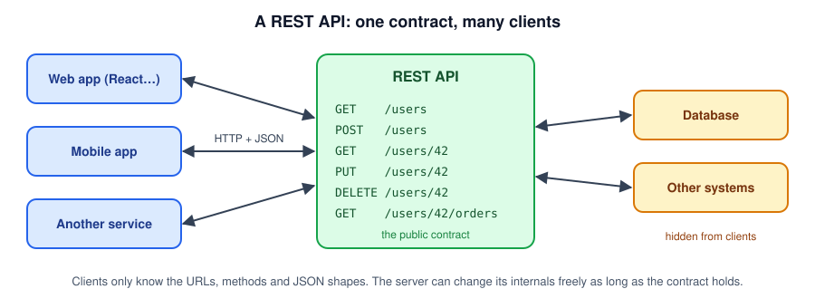
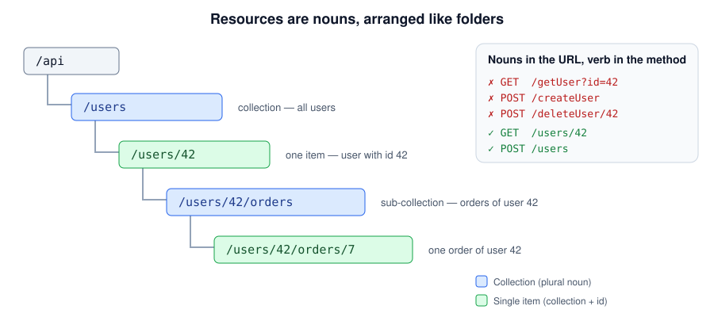
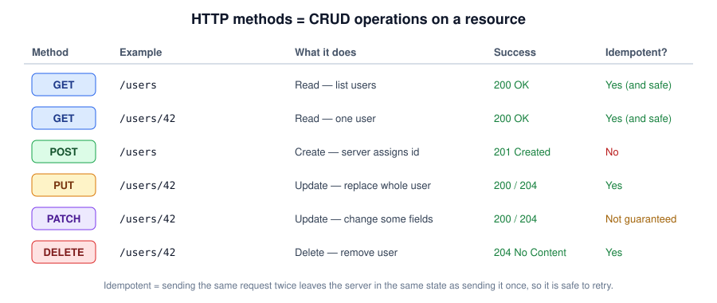
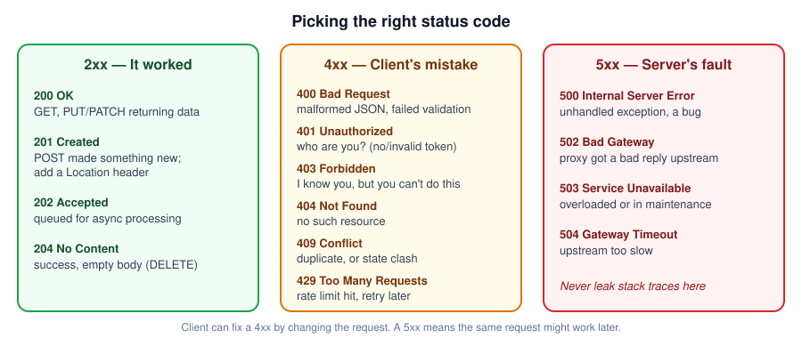
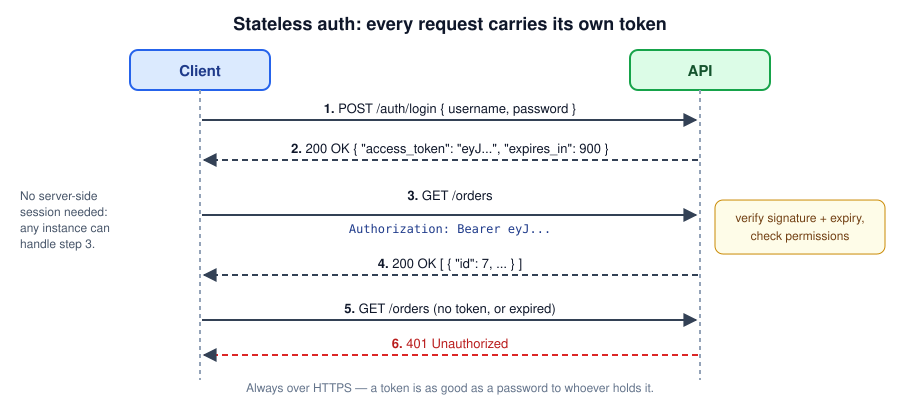
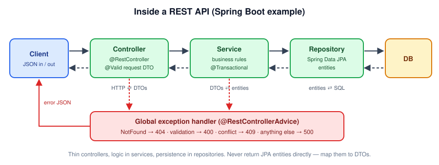

# REST APIs — A Developer's Guide

A simple, practical introduction to REST APIs: what they are, how to design them, and how to build and call one.

> **Prerequisite:** this guide builds on HTTP basics (methods, headers, status codes). If those are new, read [intro_web.md](intro_web.md) first.

---

## Table of Contents

- [What Is an API?](#what-is-an-api)
- [What Makes an API "REST"?](#what-makes-an-api-rest)
- [Resources and URLs](#resources-and-urls)
- [HTTP Methods: The Verbs](#http-methods-the-verbs)
- [Status Codes: The Outcome](#status-codes-the-outcome)
- [Request and Response Bodies](#request-and-response-bodies)
- [Errors](#errors)
- [Filtering, Sorting and Pagination](#filtering-sorting-and-pagination)
- [Authentication: Stateless by Design](#authentication-stateless-by-design)
- [Versioning](#versioning)
- [Inside a REST API (Spring Boot)](#inside-a-rest-api-spring-boot)
- [Documenting with OpenAPI](#documenting-with-openapi)
- [Calling a REST API](#calling-a-rest-api)
- [REST vs GraphQL vs gRPC](#rest-vs-graphql-vs-grpc)
- [Design Checklist](#design-checklist)
- [Further Reading](#further-reading)

---

## What Is an API?

An **API** (Application Programming Interface) is a **contract** that lets one program use another without knowing how it's built inside.

A restaurant menu works like an API: you pick from a fixed list (the menu), the waiter takes the order (the request), and food comes back (the response). You never walk into the kitchen.

A **web API** is that contract offered over HTTP. A **REST API** is the most common style of web API.



Because every client talks to the same contract, one backend can serve a web app, a mobile app, and other services at the same time. The backend's internals (database, frameworks, other systems) can change without breaking anyone, **as long as the contract doesn't change**.

---

## What Makes an API "REST"?

**REST** (REpresentational State Transfer) is a set of design rules, not a library or a protocol. In plain terms:

| Principle | Plain-English meaning |
|---|---|
| **Resources** | Everything is a "thing" with its own URL: a user, an order, an invoice. |
| **Representations** | You don't get the thing itself, you get a *representation* of it, usually JSON. |
| **Uniform interface** | You use standard HTTP methods (`GET`, `POST`, `PUT`, `PATCH`, `DELETE`) on those URLs, so every REST API feels familiar. |
| **Stateless** | Each request contains everything the server needs (including who you are). The server keeps no memory of past requests between calls. |
| **Client–server** | The client (UI) and server (data + logic) are separate and evolve independently. |
| **Cacheable** | Responses say whether they can be cached, so clients and proxies can avoid repeat work. |
| **Layered** | The client can't tell (and doesn't care) whether there's a CDN, load balancer, or gateway in between. |

> In practice, "REST API" usually means **JSON over HTTP, organized around resources, using HTTP methods and status codes correctly**. That's what the rest of this guide covers.

---

## Resources and URLs

Design your API around **nouns** (the things), not **verbs** (the actions). The HTTP method is the verb.



**URL rules of thumb:**

| Rule | Good | Avoid |
|---|---|---|
| Use plural nouns for collections | `/users` | `/user`, `/userList` |
| Identify one item by id | `/users/42` | `/users?id=42` (for a single item) |
| Nest only for real ownership, max ~2 levels | `/users/42/orders` | `/users/42/orders/7/items/3/notes` |
| Lowercase, hyphenate multi-word names | `/order-items` | `/orderItems`, `/Order_Items` |
| No verbs in the path | `POST /users` | `POST /createUser` |
| No file extensions | `/users/42` + `Accept: application/json` | `/users/42.json` |

**When an action doesn't fit CRUD** (e.g. "cancel an order", "resend an email"), there are two common patterns:

```
POST /orders/7/cancellation        # treat the action as a sub-resource (more RESTful)
POST /orders/7:cancel              # an explicit action (used by Google APIs)
```

Pick one style and use it consistently.

---

## HTTP Methods: The Verbs



Two properties matter a lot in real systems:

- **Safe:** the request doesn't change anything (`GET`, `HEAD`, `OPTIONS`). Crawlers, prefetchers and caches assume this, so **never change data in a `GET`**.
- **Idempotent:** doing it twice has the same effect as doing it once (`GET`, `PUT`, `DELETE`). Networks fail and clients retry, so idempotent operations are safe to retry automatically.

`POST` is **not** idempotent: retrying it after a timeout can create a duplicate order. For important `POST`s (payments, orders), accept an **`Idempotency-Key`** header. The server remembers the key, and a retry with the same key returns the original result instead of doing the work again.

**`PUT` vs `PATCH`:**

```http
PUT /users/42                          PATCH /users/42
{ "name": "Ada", "email": "a@x.io",    { "email": "new@x.io" }
  "role": "admin" }
→ replaces the whole user.             → changes only email.
  Fields you omit may be reset.          Everything else stays the same.
```

---

## Status Codes: The Outcome

The status code is the first thing a client checks, so pick it carefully. Never return `200 OK` with `{"error": "..."}` in the body.



**Common confusions:**

| Question | Answer |
|---|---|
| `401` or `403`? | `401` = "I don't know who you are" (missing/invalid token). `403` = "I know who you are, but you're not allowed". |
| `400` or `422`? | Both are used for validation errors. `400` is the more common default; some teams reserve `422` for "valid JSON, but breaks a business rule". Be consistent. |
| `404` for someone else's resource? | Often yes. Returning `404` instead of `403` avoids revealing that the resource exists. |
| Empty search results? | `200 OK` with an empty list `[]`, **not** `404`. The collection exists; it's just empty. |

---

## Request and Response Bodies

JSON is the default. A few conventions keep APIs pleasant to use:

```http
POST /api/v1/users HTTP/1.1
Content-Type: application/json
Accept: application/json

{
  "name": "Ada Lovelace",
  "email": "ada@example.com"
}
```

```http
HTTP/1.1 201 Created
Location: /api/v1/users/42
Content-Type: application/json

{
  "id": 42,
  "name": "Ada Lovelace",
  "email": "ada@example.com",
  "createdAt": "2026-09-27T10:15:30Z"
}
```

| Convention | Why |
|---|---|
| Pick one field casing (`camelCase` is common in JSON) and never mix | Predictable for clients |
| Dates in **ISO-8601 UTC** (`2026-09-27T10:15:30Z`) | No time zone ambiguity |
| Return the created/updated resource (or `Location` header) | Saves the client a second call |
| Don't expose internal fields (password hashes, DB-internal ids, audit columns) | Security, and freedom to change internals |
| Money as a string or integer minor units (`"19.99"` or `1999`), never float | Floats lose precision |
| Use **separate request and response models** (DTOs) | Clients can't set fields like `id` or `role` that they shouldn't control |

---

## Errors

Give errors a **consistent shape** so clients can handle them in one place. The standard format is **Problem Details** ([RFC 9457](https://www.rfc-editor.org/rfc/rfc9457)), with content type `application/problem+json`:

```json
{
  "type": "https://api.example.com/problems/validation-error",
  "title": "Validation failed",
  "status": 400,
  "detail": "One or more fields are invalid.",
  "instance": "/api/v1/users",
  "errors": [
    { "field": "email", "message": "must be a well-formed email address" }
  ]
}
```

**Error rules:**
- The HTTP status code and the `status` field must match.
- Messages should help the **caller** fix the request.
- **Never** leak stack traces, SQL, or internal hostnames. Log those server-side with a correlation id and return that id to the client instead.

---

## Filtering, Sorting and Pagination

Never return an unbounded list. A table with a million rows will eventually take down your API. Use **query parameters** on collection endpoints:

```
GET /api/v1/orders?status=shipped&customerId=42     # filter
GET /api/v1/orders?sort=createdAt,desc              # sort
GET /api/v1/orders?page=2&size=20                   # offset pagination
GET /api/v1/orders?limit=20&after=eyJpZCI6MTAwfQ    # cursor pagination
```

| Style | How it works | Good for | Weakness |
|---|---|---|---|
| **Offset** (`page`, `size`) | "Skip 40, take 20" | Admin tables, jump to page N | Slow on huge tables; items shift if data changes |
| **Cursor** (`after`, `limit`) | "Give me 20 after this marker" | Feeds, infinite scroll, large/fast-changing data | Can't jump to an arbitrary page |

Return paging metadata with the results:

```json
{
  "content": [ { "id": 101 }, { "id": 102 } ],
  "page": 2, "size": 20, "totalElements": 873, "totalPages": 44
}
```

Set a **maximum page size** on the server (e.g. 100) no matter what the client asks for.

---

## Authentication: Stateless by Design

Because REST is stateless, the client proves who it is **on every request**, usually with a token in the `Authorization` header.



| Method | Typical use |
|---|---|
| **Bearer token (JWT / OAuth 2.0 access token)** | User-facing apps and most modern APIs. Short-lived; refreshed with a refresh token. |
| **API key** (`X-API-Key` header) | Server-to-server or public developer APIs. Simple, but treat keys like passwords. |
| **mTLS** (client certificates) | High-trust internal service-to-service traffic. |

**Security basics:**
- HTTPS only. A token over plain HTTP can be read by anyone on the network.
- Authenticate (who are you?) **and** authorize (are you allowed to touch *this* resource?). A classic bug is checking the token but not checking that order 7 actually belongs to user 42.
- Never put tokens or secrets in URLs. URLs end up in logs, browser history and proxies.
- Rate-limit and return `429 Too Many Requests` with a `Retry-After` header.

---

## Versioning

Once clients depend on your API, you can't freely change it. Plan for it on day one.

**Non-breaking (safe) changes:** adding a new endpoint, adding an optional request field, adding a response field.
**Breaking changes:** removing or renaming a field, changing a type, making an optional field required, changing a URL or a status code.

| Strategy | Example | Notes |
|---|---|---|
| **URL path** | `/api/v1/users` | Most common, obvious, easy to route and test. |
| Header | `Accept: application/vnd.example.v2+json` | Cleaner URLs, harder to test in a browser. |
| Query param | `/users?version=2` | Easy, but mixes versioning with filtering. |

Whichever you pick: **make additive changes whenever possible**, tell clients to **ignore unknown fields**, and give deprecated versions a published end-of-life date.

---

## Inside a REST API (Spring Boot)

A well-structured REST service keeps each layer focused:



A minimal example (Spring Boot 3, Java 21):

```java
// DTOs: immutable records, validated at the API boundary
public record CreateUserRequest(
        @NotBlank @Size(max = 100) String name,
        @NotBlank @Email String email) {}

public record UserResponse(Long id, String name, String email) {}
```

```java
@RestController
@RequestMapping("/api/v1/users")
public class UserController {

    private final UserService userService;

    public UserController(UserService userService) {   // constructor injection
        this.userService = userService;
    }

    @GetMapping("/{id}")
    public UserResponse getUser(@PathVariable Long id) {
        return userService.getUser(id);                  // 200 OK
    }

    @GetMapping
    public Page<UserResponse> listUsers(@PageableDefault(size = 20) Pageable pageable) {
        return userService.listUsers(pageable);          // paginated
    }

    @PostMapping
    public ResponseEntity<UserResponse> createUser(@Valid @RequestBody CreateUserRequest request) {
        UserResponse created = userService.createUser(request);
        URI location = URI.create("/api/v1/users/" + created.id());
        return ResponseEntity.created(location).body(created);   // 201 + Location
    }

    @DeleteMapping("/{id}")
    @ResponseStatus(HttpStatus.NO_CONTENT)
    public void deleteUser(@PathVariable Long id) {
        userService.deleteUser(id);                      // 204 No Content
    }
}
```

```java
@RestControllerAdvice
public class GlobalExceptionHandler {

    private static final Logger log = LoggerFactory.getLogger(GlobalExceptionHandler.class);

    @ExceptionHandler(UserNotFoundException.class)
    public ProblemDetail handleNotFound(UserNotFoundException ex) {
        return ProblemDetail.forStatusAndDetail(HttpStatus.NOT_FOUND, ex.getMessage());
    }

    @ExceptionHandler(Exception.class)
    public ProblemDetail handleUnexpected(Exception ex) {
        log.error("Unhandled error", ex);                // full detail in logs only
        return ProblemDetail.forStatusAndDetail(
                HttpStatus.INTERNAL_SERVER_ERROR, "An unexpected error occurred.");
    }
}
```

**What this shows:**
- **Controller** handles only HTTP: mapping, validation (`@Valid`), status codes. No business logic.
- **Service** holds the business rules and transactions, and maps entities ⇄ DTOs.
- **Repository** handles persistence.
- **Entities never leave the service layer.** Returning JPA entities directly leaks internal fields and ties your API contract to your database schema.
- **One exception handler** gives every error the same Problem Details shape. Spring's own validation errors can use the same shape by setting `spring.mvc.problemdetails.enabled=true`.

---

## Documenting with OpenAPI

**OpenAPI** (formerly Swagger) is the standard, machine-readable description of a REST API: endpoints, parameters, request/response schemas, auth, and error codes.

With Spring Boot, **springdoc-openapi** generates it from your controllers:

```xml
<dependency>
    <groupId>org.springdoc</groupId>
    <artifactId>springdoc-openapi-starter-webmvc-ui</artifactId>
    <version><!-- latest 2.x compatible with your Spring Boot version --></version>
</dependency>
```

Then open:
- `http://localhost:8080/swagger-ui.html`: interactive docs where you can try requests.
- `http://localhost:8080/v3/api-docs`: the raw OpenAPI JSON. You can generate typed clients from it for TypeScript, Java, and more.

Annotations like `@Operation`, `@ApiResponse`, and `@Schema` add descriptions and examples where the generated docs aren't clear enough.

---

## Calling a REST API

```bash
# Read
curl -s https://jsonplaceholder.typicode.com/users/1

# Create (see the status line and headers with -i)
curl -i -X POST https://jsonplaceholder.typicode.com/posts \
     -H "Content-Type: application/json" \
     -d '{"title":"Hello","body":"First post","userId":1}'

# Authenticated request
curl -H "Authorization: Bearer $TOKEN" https://api.example.com/api/v1/orders

# Pretty-print JSON
curl -s https://jsonplaceholder.typicode.com/users/1 | jq .
```

From JavaScript:

```javascript
const res = await fetch("/api/v1/users", {
  method: "POST",
  headers: { "Content-Type": "application/json" },
  body: JSON.stringify({ name: "Ada", email: "ada@example.com" }),
});
if (!res.ok) {                       // fetch does NOT throw on 4xx/5xx
  const problem = await res.json();
  throw new Error(problem.detail);
}
const user = await res.json();
```

**Useful tools:** `curl`, [Postman](https://www.postman.com/) / [Bruno](https://www.usebruno.com/), IntelliJ / VS Code `.http` files, Swagger UI, and the browser DevTools Network tab.

---

## REST vs GraphQL vs gRPC

REST isn't the only option. Here is how it compares:

| | **REST** | **GraphQL** | **gRPC** |
|---|---|---|---|
| Shape | Many URLs, one per resource | One endpoint, client writes a query | Remote function calls from a `.proto` contract |
| Format | JSON (text) | JSON (text) | Protobuf (binary) over HTTP/2 |
| Strengths | Simple, universal, HTTP caching works, easy to debug | Client gets exactly the fields it needs in one round trip | Very fast, strongly typed, streaming |
| Weaknesses | Over/under-fetching, many round trips for nested data | Caching and rate limiting are harder, more server complexity | Not browser-native, harder to inspect by hand |
| Typical use | Public APIs, CRUD services, most web/mobile backends | Complex UIs aggregating many data sources | Internal service-to-service calls |

**Default to REST** unless you have a specific problem one of the others solves.

---

## Design Checklist

Before you ship an endpoint:

- [ ] URL is a **plural noun**, no verbs, consistent casing
- [ ] Correct **method** (no data changes in `GET`)
- [ ] Correct **status code** for success and each failure
- [ ] **Validated** input with clear, field-level error messages
- [ ] Errors use one consistent format (**Problem Details**)
- [ ] **Separate request/response DTOs**; no entities or internal fields exposed
- [ ] Collections are **paginated** with a max page size
- [ ] **Authenticated and authorized** per resource, HTTPS only
- [ ] Retry-sensitive `POST`s support an **idempotency key**
- [ ] **Versioned**, and changes are additive where possible
- [ ] **Documented** in OpenAPI with examples
- [ ] Logged with a correlation id; no secrets or tokens in logs

---

## Further Reading

- [intro_web.md](intro_web.md): how the web and HTTP work underneath REST
- [MDN — HTTP request methods](https://developer.mozilla.org/en-US/docs/Web/HTTP/Reference/Methods)
- [MDN — HTTP response status codes](https://developer.mozilla.org/en-US/docs/Web/HTTP/Reference/Status)
- [RFC 9457 — Problem Details for HTTP APIs](https://www.rfc-editor.org/rfc/rfc9457)
- [Microsoft REST API Guidelines](https://github.com/microsoft/api-guidelines)
- [Google API Design Guide](https://cloud.google.com/apis/design)
- [OpenAPI Specification](https://spec.openapis.org/oas/latest.html) · [springdoc-openapi](https://springdoc.org/)
- [Roy Fielding's dissertation, Chapter 5](https://ics.uci.edu/~fielding/pubs/dissertation/rest_arch_style.htm): where REST was defined
